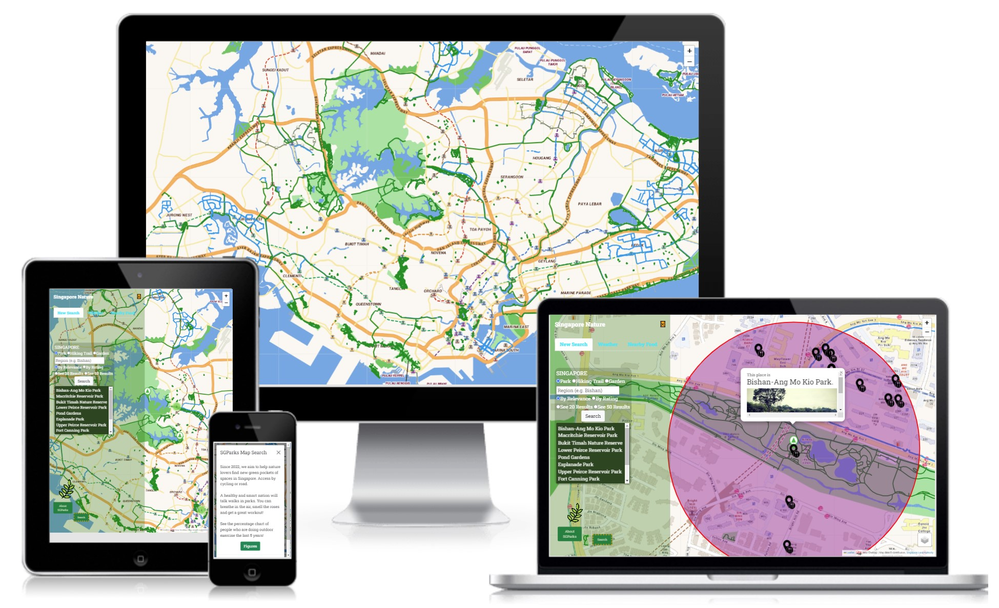

# **ParkProjector**

**Link to demo : [Park Projector](https://frabjous-buttercream-d36934.netlify.app/)**

## Summary
Park Projector is a park finder website for nature lovers. 

It helps people to locate the nearby parks, trails and gardens based on typing a location name. IT encourages people to spend more time exploring a park, exercise or talk a walk in it. 

---

## UI/UX

The users of this app are usually busy with school or work. They would use this app for greater convenience to search for nature places to unwind or exercise. The app is designed to help them locate nearby park spaces and other useful amenities such as pathways or resting foodstops nearby. 

### User Goals
The project caters to working adults who exercise, nature hikers and cyclists. The project aim allows easy search of all the parks, gardens and hiking trails in Singapore. 

It allows them to find connecting paths and nearby places; either to relax or talk a walk in. It also provides information on the weather patterns to plan their outdoor activity wisely.

### Organisational Goals
Companies like the NParks and Singapore Sports Council would encourage such apps in line with the ActiveSG initiative.

### Design Decisions

#### Color scheme

The main color of the app was green because it is in line with the naturalness, beauty and serenity of nature. In a green space, people are more relaxed and they have a good backdrop to conduct their exercise activities. The other 
colors are to provide contrast
to the green but is also harmonious with green.

### Fonts

The font chosen is Roboto Slab. This is a look that is in line with some fonts used by nature websites to keep a clean and pristine look. 

---

## Functions

| Functions | Explanation |
| ----------- | ----------- |
| Search park, hiking trail, garden| This allows to search general outdoor places in Singapore to suggest to the user.|
| Search by region| This allows search based on the town name to cater to more personalised location for the user|
| Sort search by relevance or rating| This allows user to indicate if they prefer results based on relevance or overall ratings to be reflected in their search results.|
|Display 20 or 50 results| This allows user customise more or less search results to be reflected on the screen for a more comprehensive or generic search result.|
| Drop down result list| This allows user to see the name of all the relevant nature places based on their search interest.|
| Map| This allows user to view the map of Singapore and decide which area's parks they prefer to visit.|
| Map zoom on park| This allows user to see the specific park location and surronding landmarks in more detail.|
| Map pop up| This allows user to see the name and associated picture of the park.|
| Map zoom on park| This allows user to see the specific location and the localised surrounding of the searched nature area.|
|Weather tab| This allows user to see the weather of the current park selected.|
| Food nearby| This allows user to see the nearby food locations for park goers who want to eat after a hike.|
|Other layers | This allows user to change look of the base map to display terrain, landscape or darkmode.|
|Other amenities layers | This allows user to display park connectors, cycling path tracks nearby, and toggle the nearby food layers on and off.|
|About SGPark | Describe to users the mission of the app.|
|Exercise figures | Encourage users to join in the movement to exercise outdoors as more people do so these days.|

---

## Limitations and Future Implementations
1. Improve on town search function 
- Search Function can only turn up accurate results for town area if the town has only one keywork(e.g. Serangoon). Whereas, search town areas like East Coast returns any nature place starting with East.
- Use nearby location tag to improve results.

2. Incorporate public transport data into search
- Only able to show MRT and bus stations on the map.
- Allow users to see pop up marker of nearest bus station and MRT station.

3. Allow clearing of food Marker layer after each new park selected
- Only able to clear food layer when page refresh (due to closure possibly).

## Technologies Used
1. HTML
2. CSS
3. Javascript
4. [Bootstrap 5](https://getbootstrap.com/docs/5.0/getting-started/introduction/) 
5. [LeafletJS](https://leafletjs.com/)
   - Create map seen on Park Projector
6. [Leaflet.markercluster](https://github.com/Leaflet/Leaflet.markercluster)
    - Create map clusters on the map
7. [Axios](https://github.com/axios/axios)
    - Retrieve API data from API websites
8. JSON PathFinder to analyse array for DOM

## Testing

| Test Case Number| Description |Step| Observation |
| ----------- | ----------- |----------- | ----------- |
|1. | Load park projector website|Go to the url| Page should not crash.|
|2. | Open Off Canvas bar |Click on green search button with orange dotted border|Off canvas bar should render with all the search options displayed.|
|3A. | Search park, hiking trail, garden|Select radio button of either park, hiking trail or garden| Generated result should be of the selected button showing either park, hiking trail or garden.|
|3B. |  Search by region|Key in one word input of town name (e.g. Serangoon).| Generated result should be showing nature places within the selected town (in this test case - Serangoon).|
|3C. | Sort search by relevance or rating|Select radio button of relevance or rating| Generated result should sort results based on relevance to search or rating of search.|
|3D. | Display 20 or 50 results|Select radio button of 20 or 50 results| Generated result should display up to 20 or up to 50 results on screen|
|4A. | Display Drop down result list|Click search after entering all search terms| Generated list should show the names of all the nature places|
|4B. | Zoom to Map park location|Click name of park in search result list| Map should zoomtoShow Layer park location and open the popUp of park description|
|5A. | Show weather pattern at location|Click weather in offcanvas panel| Should reflect weather pattern at current park location|
|5B. | Display food nearby|Click Food Nearby in offcanvas panel, followed by Display button| Should reflect markers of nearby food location and a circle circumference to show vicinity of the current park location|
|5C. | Display name of food place|Click Food Marker on map. Note need to close offcanvas panel to do so.| Should reflect name in the popup on the food location marker.|
|6A. | Other layers |Click on other base map layers in the leaflet control panel| Can change base map layer to selected layer.|
|6B. | Display amenities layers |Click Park Connectors,Cycling path track, Show nearby Food in the leaflet control panel| Should reflect layer of amenities on the park map|
|7A. | Display About SGPark|Click  About SGPark button| Should display modal about mission of the app|
|7B. | Display Figures of people who exercise|Click  Figures button in the modal panel| Should display webpage of two charts of people forms of exercise and frequency for regular exercise.|
|7C. | Return to map|Click  green back button on chart webpage| Should return to map display with results fully refreshed.|

Deployment
Netlify

---

## Reference and credit
### Fonts :
1. [Google Fonts](https://fonts.google.com/) 
- Customise website Font

### Icons :
2. [Font Awesome](https://fontawesome.com/) 
- To
create close button on site

3. [Flaticon](https://www.flaticon.com/) 
- Used 
for marker icons on website

4. [Leaflet Extras basemap]( https://leaflet-extras.github.io/leaflet-providers/preview/)
 - Provided alternative look for basemap layer

### Data :
1. [Data.gov.sg](https://data.gov.sg/) 
    - Data retrieved for cycling paths, hiking trails, sport participation on site.

2. [OpenWeather API](https://openweathermap.org/) 
    - Provided current weather information, weather icons on site.

3. [Foursquare Places Search](https://location.foursquare.com/products/places-api/)
- For search location API and image of location

### Screenshot :
1. [CreateMockup.com](https://www.createmockup.com/generate/) 
- Display look of website for README.md

### Reference :
1. [Paul's Boiler Plate Code](https://gist.githubusercontent.com/kunxin-chor/f1517e174acaf8d4d7196ad70b447f39/raw/0cabdff18d8ec0571b382346f97d020af63666a6/script.js) - Boiler plate code

2. [Wesley's README](https://github.com/e0026557/TGC-18-Project-1/blob/main/README.md ) - Consulted structure for README.md 

## Deployment :

1. [Netlify](https://www.netlify.com/) is used to deploy the website. The main branch of code is stored on Github. Steps on using Netlify is [here](https://www.netlify.com/blog/2016/09/29/a-step-by-step-guide-deploying-on-netlify/).

---

